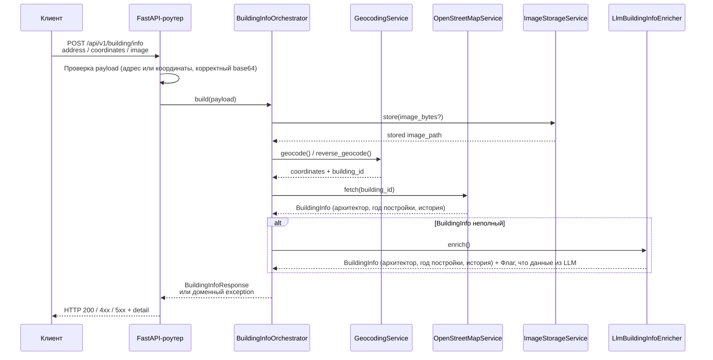

# CitySnap

CitySnap — прототип сервиса «Гид-архитектор», который по загруженной фотографии здания, его координатам или адресу подбирает историческую и архитектурную информацию.

##
Спецификацию вы можете найти в [google docs](https://docs.google.com/document/d/1GfL4O149lIRNPgLiRS-NwLaaWsizv5HgNkYWnIEMNQU/edit?pli=1&tab=t.0).

## Модули репозитория
- `city-snap-backend` — FastAPI‑шлюз, который принимает запросы от фронтенда, оркестрирует агентов (геокодирование, запрос к LLM, агрегатор данных) и возвращает структурированный ответ.
- `city-snap-frontend` — React приложение, позволяющее загрузить фотографию здания, указать адрес/координаты и визуализировать ответ сервиса.

## Локальный запуск

### Backend (`city-snap-backend`)
- Требования: Python 3.10+, Poetry.
- Переменные окружения: перед стартом укажите `OPEN_API_KEY` (ключ провайдера LLM OpenAI, получить нужно на сайте https://openai.com/api/). Без него историческое обогащение с помощью LLM будет недоступно.
  ```bash
  export OPEN_API_KEY=sk-********
  ```
- Шаги:
  ```bash
  cd city-snap-backend
  poetry env use python3.10 
  poetry install
  poetry run uvicorn citysnap.app.main:app --reload --port 8081
  ```
- Вместо прямого вызова uvicorn можно воспользоваться скриптом: `poetry run api`.
- Проверить код linter'ом: `poetry run ruff check`.
- Отформатировать код: `poetry run ruff format`.

### Frontend (`city-snap-frontend`)
- Требования: Node.js 18+ (npm входит в состав).
- Шаги:
  ```bash
  cd city-snap-frontend
  npm install
  npm run dev -- --host
  ```
- По умолчанию Vite поднимает дев-сервер на `http://localhost:5173`.

## [city-snap-backend](city-snap-backend)

Бэкенд служба по умолчанию доступна на `http://localhost:8081`.

- `GET /api/v1/health` — проверка готовности сервиса.
- `POST /api/v1/building/info` — принимает адрес, координаты и/или фотографию (base64) в теле запроса и возвращает сведения о здании.

### Поток обработки запроса



Оркестратор больше не зависит от FastAPI и выбрасывает доменные ошибки (`BuildingInfoValidationError`, `BuildingInfoNotFoundError`, `BuildingInfoUpstreamError`). Роутер конвертирует их в корректные HTTP‑ответы и выполняет простые проверки (например, что передан адрес или координаты).

### Пример запроса

Тестовые данные для запросов доступы на [google sheet](https://docs.google.com/spreadsheets/d/15YiIGK7tJGbTf-MMBv1-j_M1O-yr_wCrym39Z_2sDwk/edit?gid=0#gid=0).

```json
{
  "address": "Nevsky Prospect 28, St. Petersburg, 191186",
  "coordinates": { "lat": 59.935, "lon": 30.325 },
  "image_base64": "/9j/4AAQSkZJRgABAQAAAQABAAD..."
}
```

### Пример ответа

```json
{
  "building": {
    "name": "House of Soviets",
    "year_built": 1938,
    "architect": "Lev Rudnev",
    "location": {
      "lat": 59.9311,
      "lon": 30.3609
    },
    "history": "Built in the late 1930s, the House of Soviets is an example of Stalinist architecture, intended as an administrative hub."
  },
  "source": ["OpenStreetMap API", "Open AI LLM"]
}
```

### Curl-примеры

```bash
# Запрос по адресу
curl -X POST http://localhost:8081/api/v1/building/info \
  -H "Content-Type: application/json" \
  -d '{"address": "Красная Горка, 19 Кемерово"}'

# Запрос по координатам
curl -X POST http://localhost:8081/api/v1/building/info \
  -H "Content-Type: application/json" \
  -d '{"coordinates": {"lat": 55.3754026, "lon": 86.0725171}}'
```
